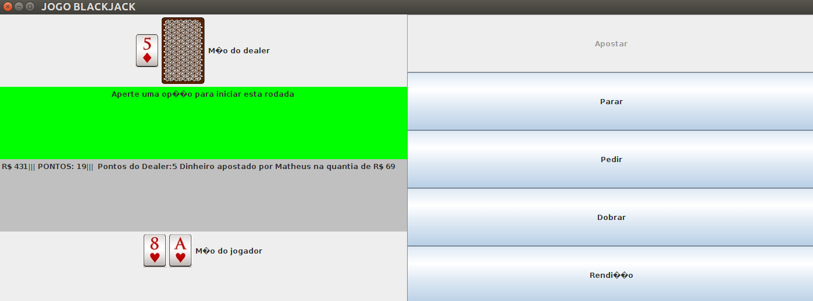

# Implementation of the game Blackjack (21) in Java using Swing
In this project, I used the Java language and the GUI widget toolkit for Java, Swing. It is a very simple application that allows the user to choose the number of decks of cards that the game will use, which affects the difficulty of the game. In this implementation, the bettor can't split his bet once he sees the cards of the dealer. If you win, you double the money that you bet. The game will end if you end up with no money. Good luck and have fun! Feel free to use the code, improve the game visually and add new features! The documentation file in the repository explains what softwares the project used and how to install them. Check it out before doing git clone. Thank you and have a good one!

WINNER, WINNER, CHICKEN DINNER!!!

# Author
- [Matheus Sereno](https://github.com/sereno29)

